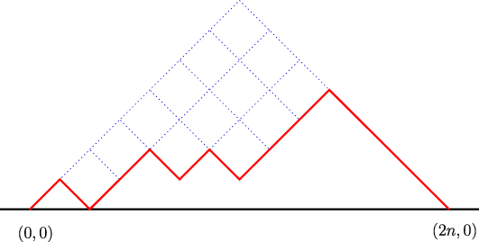

Catalan Isomorphisms
====================

Experiments with type-safe encoding and translation of various mathematical objects which are counted by the Catalan numbers, such as Dyck paths, ordered trees, binary trees, and others.

The central type defined in this module is that of a [Dyck path](http://mathworld.wolfram.com/DyckPath.html) — a lattice path which does not cross below the diagonal and terminates at the same height at which it began (illustrated below courtesy of the [Journal of Statistical Mechanics](http://iopscience.iop.org/1742-5468/2009/03/P03025/fulltext/)).



With the Catalan package, you can construct the above Dyck path in two different ways.

Using simply the type constructors:

```
D (D (D (D (U (U (U (D (U (D (U (U (D (U End)))))))))))))
```

Or more succinctly, and in an order matching the diagram, using the `(-)` operator, which is a type-restricted backwards function application:

```Haskell
(-) :: NNPath x -> (NNPath x -> NNPath y) -> NNPath y
```

```
End-U-D-U-U-D-U-D-U-U-U-D-D-D-D
```

If you don't like that the module exports an operator which occludes the normal subtraction operator, suggestions for a different name are welcome. :)
